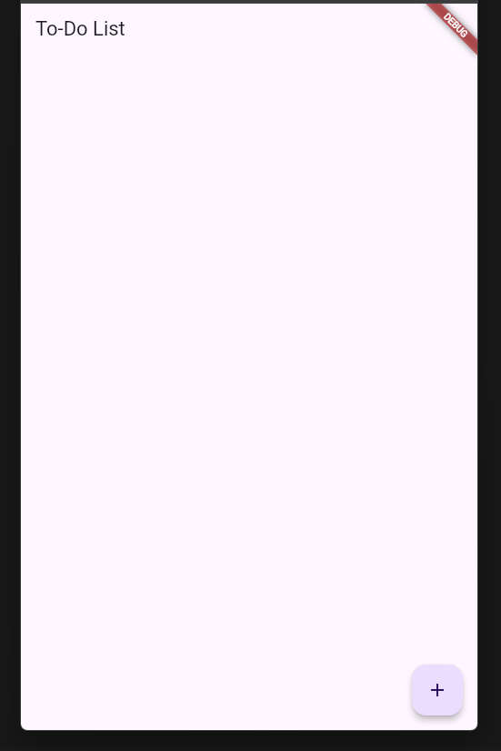
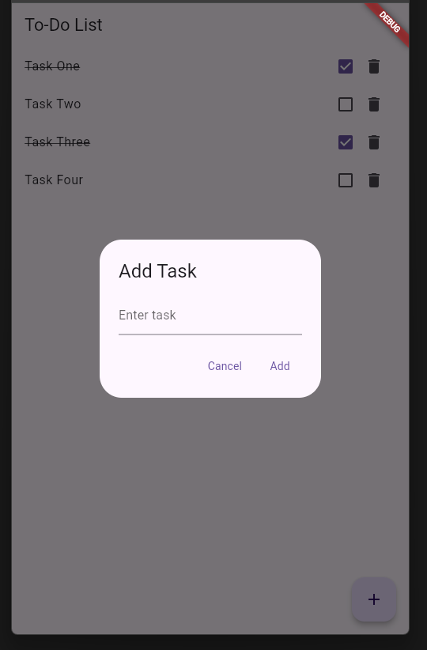

# To-Do List App

A simple To-Do List app built with Flutter.

## Features

- Add tasks
- Mark tasks as completed
- Delete tasks

## Screenshots




## Getting Started

### Prerequisites

- [Flutter](https://flutter.dev/docs/get-started/install) installed on your machine.

### Installation

1. **Clone the repository**:

    ```bash
    git clone https://github.com/Elisa-Kikota/todo_list_app.git
    cd todo_list_app
    ```

2. **Install dependencies**:

    ```bash
    flutter pub get
    ```

3. **Run the app**:

    ```bash
    flutter run
    ```

### Changing the App Icon and Name

1. **App Icon**:

    - Replace the `app_icon.png` file in `assets/images/` with your desired icon.
    - Run the following commands to generate the app icons:

        ```bash
        flutter pub get
        flutter pub run flutter_launcher_icons:main
        ```

2. **App Name**:

    - Update the `android/app/src/main/AndroidManifest.xml` file:

        ```xml
        <application
            android:label="To Do List"
            android:icon="@mipmap/ic_launcher">
            ...
        </application>
        ```

    - Update the `ios/Runner/Info.plist` file:

        ```xml
        <key>CFBundleName</key>
        <string>To Do List</string>
        ```

## Directory Structure
todo_list_app/
├── assets/
│ └── images/
│ └── app_icon.png
├── lib/
│ └── main.dart
├── android/
│ ├── app/
│ │ ├── src/
│ │ │ ├── main/
│ │ │ │ ├── AndroidManifest.xml
│ ├── build.gradle
├── ios/
│ ├── Runner/
│ │ ├── Info.plist
├── pubspec.yaml


## Contributing

1. Fork it
2. Create your feature branch (`git checkout -b feature/my-new-feature`)
3. Commit your changes (`git commit -am 'Add some feature'`)
4. Push to the branch (`git push origin feature/my-new-feature`)
5. Create a new Pull Request

## License

This project is licensed under the MIT License - see the [LICENSE.md](LICENSE.md) file for details.
